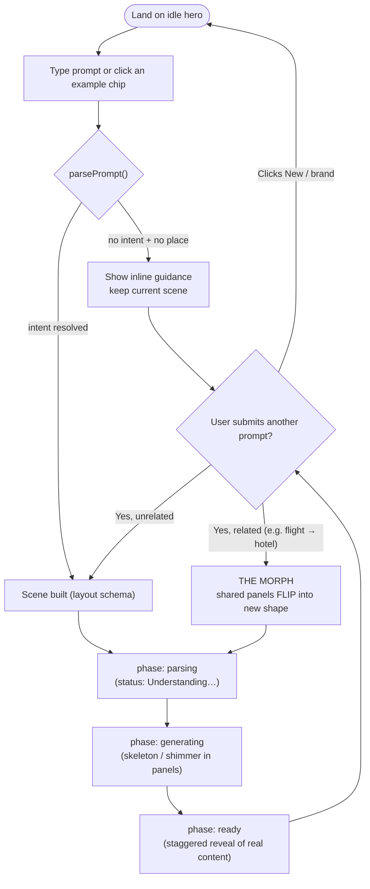
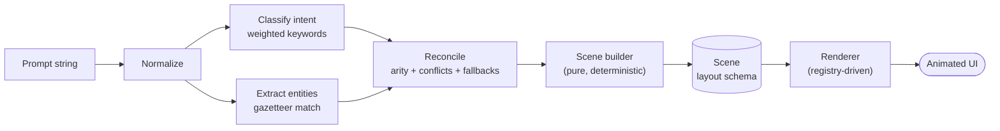

# GenTabs — Design & Technical Document

A prompt-driven **Generative UI** prototype inspired by the Google Disco / GenTabs
concept. A user types a natural-language prompt; the app deterministically parses
it into a **layout schema** and renders an animated interface on the fly — panels
slide in, a map springs up, a route draws itself, and shared elements **morph**
between states instead of hard-cutting.

> There is no LLM in the loop. The "intelligence" being demonstrated is the
> prompt → layout mapping engine and the motion choreography, exactly as the
> assessment specifies. The architecture is, however, shaped so a live LLM could
> be dropped in without touching the renderer (see [§7](#7-future-scalability)).

This document covers the three required areas — **user flow**, **prompt → UI
mapping architecture**, and **motion design strategy** — plus component
architecture, accessibility, and future scalability.

---

## 1. User Flow



### Two signature journeys (from the brief)

**A. The Transition** — `"Show my flight route from New York to London"`
1. The centered hero **prompt bar contracts and repositions** to the top strip
   (`layout` FLIP, single mounted element).
2. The **map stage scales up** into the workspace with a spring camera move.
3. An **SVG route path draws itself** (animated `pathLength`) from the New York
   marker to the London marker.
4. A **detail rail slides in** on the right and its fields enter **staggered**
   (flight number, duration, landing time).

**B. The Morph** — then `"Show me my hotel details for London"`
1. Nothing unmounts or flashes.
2. The **route fades out**; the **camera zooms** from the transatlantic framing
   (fitted to the route, at most `zoom 1.25`) into the London region (`zoom 3.4`).
3. The **detail rail does not disappear** — it keeps its identity
   (`layoutId="detail-panel"`) and **FLIP-resizes**, its flight stats
   cross-fading into a hotel check-in card inside the re-flowed container.

---

## 2. Prompt → UI Mapping Architecture

The core design decision is an **indirection layer**: prompt text is never
consumed by components directly. Instead it is compiled into a normalized,
serializable **`Scene`** (the *layout descriptor*), and the renderer only ever
knows about that schema.



### 2.1 The pipeline (`lib/intent/parser.ts`)

| Stage | Responsibility | Key data structure |
|---|---|---|
| **Normalize** | lowercase, collapse whitespace, pad with spaces for word-boundary matching | `string` |
| **Classify** | score each intent by weighted keyword hits; sort descending | `IntentSpec[]` (`keywords: Record<string, number>`) |
| **Extract** | resolve place entities via longest-match-first, word-boundary regex, de-duplicated and ordered by appearance | `Place[]` from the **gazetteer** |
| **Reconcile** | apply per-intent **arity** rules and resolve **conflicts** & missing data with sensible fallbacks | `ParseResult` |
| **Build** | deterministic pure function → concrete `Scene` | `Scene` |

**Intent classification** is intentionally transparent and tunable — a bag of
weighted keywords rather than a black box:

```ts
{ kind: "flight", arity: 2, keywords: { flight: 3, fly: 3, route: 2, trip: 1 } }
```

The highest-scoring intent wins, which is also how **conflicting layout states**
are resolved: a prompt containing both "flight" and "hotel" words resolves to
whichever has the higher weighted score, deterministically.

**Entity extraction** uses a small local **gazetteer** (`lib/intent/gazetteer.ts`):
each `Place` carries `lat/lng` + `aliases`. A shared `project(lat, lng)` maps
geography to the stage's normalized `0..1` space using an equirectangular
projection — the *same* projection the stylized world map is laid out on, so a
projected marker lands on the matching landmass.

### 2.2 The layout descriptor (`lib/intent/types.ts`)

`Scene` is the contract between parsing and rendering:

```ts
interface Scene {
  key: string;              // stable render identity
  intent: IntentKind;
  prompt: string;
  headline: string;         // narrates what is being "generated"
  stage: StageConfig;       // camera + markers + optional route + overlay
  detail: DetailPanel | null;
  chips: string[];          // staggered quick-facts
}
```

Two schema decisions make the morph possible and the system extensible:

1. **Stable panel identity.** `DetailPanel.id` is always `"detail"`, regardless
   of variant (`flight | hotel | weather | places`). Same id ⇒ the renderer
   treats a flight panel and a hotel panel as **the same physical element** ⇒
   Framer Motion FLIP morphs one into the other rather than unmount/remount.

2. **Camera as data.** The map never re-instantiates; scenes only change
   `stage.camera` (`x, y, zoom`) and `stage.markers/route`. Every visual change
   is therefore a *tween between two schema values*, not a teardown.

3. **Intent, not pixels.** A builder can't compute the zoom that frames a route,
   because the answer depends on the container's aspect ratio at render time. So
   the descriptor states the *requirement* — `camera.fit`, a normalized rectangle
   that must stay in shot — and `<MapStage/>` resolves it against the measured
   container, treating `camera.zoom` as the tightest allowed framing. A short hop
   (New York → London) keeps its authored `1.25`; a half-the-globe route
   (San Francisco → Sydney) pulls back until both cities are on screen, at any
   viewport. Single-focus scenes omit `fit` and just use `zoom`.

   This is the descriptor boundary working as intended: the parser stays pure and
   deterministic (and therefore unit-testable), while anything that needs to know
   about pixels stays in the renderer.

### 2.3 Registry-driven rendering

Rendering is **data lookups, not branching**. `components/registry.tsx` maps a
variant to its presentation metadata (label, icon). Adding a new capability is a
three-line change — add a keyword set, a gazetteer entry if needed, and a scene
builder — with **no renderer edits**. This is the "modular layout" requirement in
practice.

### 2.4 Edge cases & conflicting states

| Input | Behavior |
|---|---|
| Empty prompt | Inline hint; no scene teardown. |
| Unrecognized ("asdfghjkl") | Guidance message with concrete examples; current scene preserved. |
| Bare place ("London") | Defaults to a **places** overview at low confidence (0.4). |
| Flight with one city | Fills the missing endpoint with a default hub (NYC/London). |
| Flight with zero cities | Falls back to the canonical NYC → London demo. |
| Both "flight" & "hotel" words | Higher weighted score wins (deterministic). |

A `confidence` score (0–1) is returned with every parse and surfaced in the UI,
giving the user a "did we understand you?" affordance.

---

## 3. Motion Design Strategy

### 3.1 Framework choice — **Framer Motion**

Chosen over GSAP / WAAPI for one decisive reason: **`layout` + `layoutId` give
FLIP for free**, which is exactly the primitive the Morph example demands.
Framer computes First/Last bounding boxes, inverts the delta, and plays a
spring — across size, position, *and* reparenting — without manual measurement.
It also ships a first-class `useReducedMotion()` hook, keeping accessibility in
the same system rather than bolted on.

### 3.2 Motion tokens (`lib/motion/tokens.ts`)

All motion references shared **spring profiles** so the whole interface speaks
one physical language:

| Token | Use | Character |
|---|---|---|
| `spring.press` | hover / tap on buttons & inputs | snappy (stiffness 520) |
| `spring.layout` | panel morphs & docking | weighty, no overshoot (240 / 30) |
| `spring.entrance` | panels & staggered items entering | gentle (260 / 32) |
| `spring.camera` | map zoom / pan | slow, cinematic (120 / 26) |

### 3.3 State-transition logic (`lib/useGenerationMachine.ts`)

A small explicit machine drives the *fake generation* so transitions are staged,
not instantaneous:

```
idle ──submit──► parsing ──(≈420ms)──► generating ──(≈620ms)──► ready
        ▲                                                          │
        └──────────────────── submit (morph) ──────────────────────┘
```

- **parsing** — prompt accepted; status reads "Understanding your prompt…".
- **generating** — scene resolved; the persistent panels render **skeleton /
  shimmer** so the reveal reads as the container *filling in*.
- **ready** — real content mounts with a **staggered** entrance
  (`staggerChildren: 0.07`, blur-to-sharp).

Crucially, on a follow-up prompt the previous scene's panels stay mounted, so the
machine's next `generating → ready` cycle is expressed **as a morph**, not a
reset. All durations collapse to ~near-zero under reduced motion.

### 3.4 Maintaining visual continuity during structural shifts

| Structural change | How continuity is preserved |
|---|---|
| Hero → active | The prompt bar is **one mounted element**; `layout` FLIP-slides it from center to the docked top strip. |
| Flight panel → hotel card | Shared `layoutId="detail-panel"`; the container FLIP-resizes while inner content cross-fades (`fadeThrough`, `AnimatePresence mode="wait"`). |
| Transatlantic view → city view | The map **camera** springs (`scale`/pan) instead of swapping images; markers **counter-scale** (`1/zoom`) so labels stay crisp. |
| Route add / remove | `motion.path` animates `pathLength` in, and fades out on `AnimatePresence` exit — never a hard cut. |
| Content reveal | Skeletons occupy final geometry first, so revealed content does not shift layout (no CLS). |

### 3.5 Performance

Only **compositor-friendly** properties are animated (`transform`, `opacity`,
`pathLength`); no animation of `width`/`top`/`left` on the hot path. Layout
projection is handled by Framer's FLIP engine (transform-based). Springs are
interruptible, so rapid successive prompts redirect mid-flight rather than
queueing.

---

## 4. Component Architecture

```
app/
  layout.tsx            Root shell, theme bootstrap (no-flash), skip link
  page.tsx              Orchestrator: machine + prompt region + scene switch
  globals.css           Design-token layer (CSS vars), shimmer, reduced-motion
components/
  Workspace.tsx         Responsive stage | detail grid
  registry.tsx          intent → presentation metadata (extension point)
  panels/
    MapStage.tsx        Persistent map: camera, graticule, land, markers, route
    DetailPanel.tsx     The morphing panel (layoutId, skeleton→content)
  system/
    PromptBar.tsx       Single persistent input (hero ↔ docked)
    GenerationStatus.tsx  aria-live narration of the lifecycle
    ChipRow.tsx         Staggered quick-facts
    Skeleton.tsx        Shimmer primitives
    ThemeToggle.tsx     Light/dark, persisted
lib/
  intent/               parser · gazetteer · builders · types  (prompt→schema)
  motion/tokens.ts      spring/easing profiles + shared variants
  useGenerationMachine.ts   lifecycle state machine
  clsx.ts               classnames helper
```

### Modular state handling

- **Local, colocated state.** All generation state lives in one hook
  (`useGenerationMachine`) returning `{ state, submit, reset }`. Components are
  otherwise stateless and driven by props — easy to test and reason about.
- **Pure core.** `lib/intent/*` is synchronous and side-effect free; it can be
  unit-tested (and was — see the repo README) without React.
- **Data down, one action up.** The page owns the machine; panels receive
  `scene` + `phase` and render.

### Naming conventions

- **Components** `PascalCase` (`MapStage`), one component family per file.
- **Hooks** `useX` (`useGenerationMachine`).
- **Pure modules & helpers** `camelCase` (`parsePrompt`, `project`, `arcMidpoint`).
- **Types/interfaces** `PascalCase` (`Scene`, `DetailPanel`, `ParseResult`).
- **Design tokens** semantic CSS variables (`--ink-muted`, `--accent-soft`), never
  raw hex in components.
- **Motion tokens** namespaced (`spring.layout`, `staggerItem`).

---

## 5. Design System & Visual Engineering

- **Type scale** — a single modular scale (`2xs → 3xl`) in `tailwind.config.ts`
  with tuned line-heights and letter-spacing for headings; a predictable
  hierarchy (eyebrow → title → field labels/values).
- **Spacing** — 8pt rhythm with a few half-steps; layout gaps are token-based.
- **Color** — semantic tokens via CSS variables (`--ink`, `--surface`, `--accent`
  …) enabling a full **light/dark** theme by swapping the variable block. Body
  ink targets ≥ 7:1 contrast, muted text ≥ 4.5:1 (WCAG AA/AAA).
- **Elevation & radius** — tokenized shadows (`card`, `raised`, `focus`) and a
  radius scale for consistent surfaces.

---

## 6. Responsive & Accessible UI

**Responsive**
- `< lg`: stacked — map on top, detail rail below (fluid CSS grid; same panels
  reflow rather than re-mount).
- `≥ lg`: two columns — fluid map + fixed 360px detail rail.
- The prompt bar, example chips, and status adapt (compact variants) across
  breakpoints.

**Accessibility**
- Semantic HTML: `header`/`main`/`aside`/`section`, `dl/dt/dd`, `ol/li`.
- **Skip-to-content** link; visible, tokenized keyboard focus rings on all
  interactive elements.
- The map exposes a descriptive `role="img"` + `aria-label` (e.g. "Map showing a
  route from New York to London"); decorative SVG is `aria-hidden`.
- Generation lifecycle is announced via an `aria-live="polite"` status region.
- **`prefers-reduced-motion`** is honored in two layers: a global CSS reset
  (neutralizes shimmer/transitions) **and** `useReducedMotion()` in code, which
  swaps positional/scale animations for plain opacity fades and shortens the
  machine's timings.
- Example prompts are real `<button>`s with `aria-pressed` state.

---

## Prompt cheatsheet

| Prompt | Intent | Result |
|---|---|---|
| `Show my flight route from New York to London` | flight | Transatlantic route + flight rail |
| `Show me my hotel details for London` | hotel | **Morphs** rail → hotel card, zooms to London |
| `What's the weather in Tokyo` | weather | Zooms to Tokyo, weather overlay + forecast |
| `Things to do in Paris` | places | POI markers + curated list |
| `Flight from San Francisco to Sydney` | flight | Trans-Pacific route |
| `London` | places (fallback) | Places overview, low confidence |
